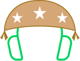
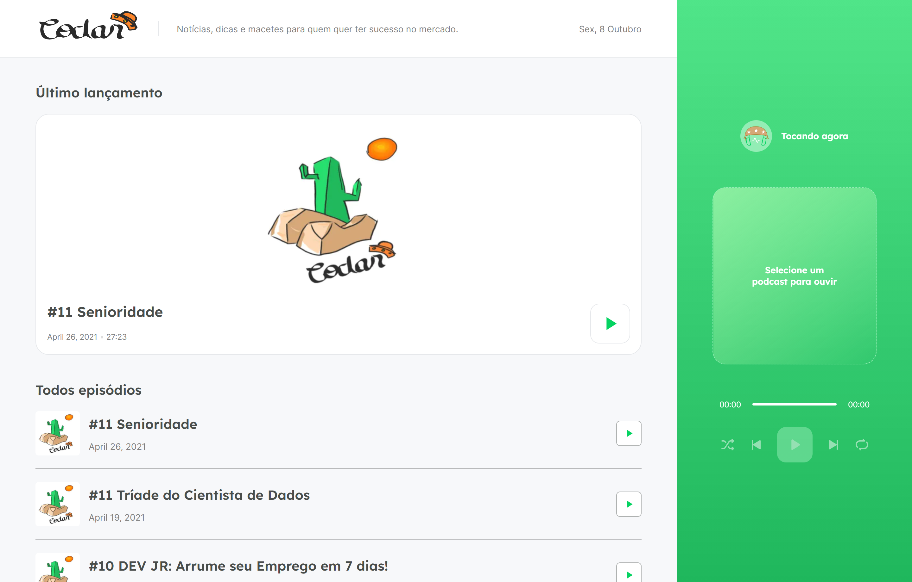
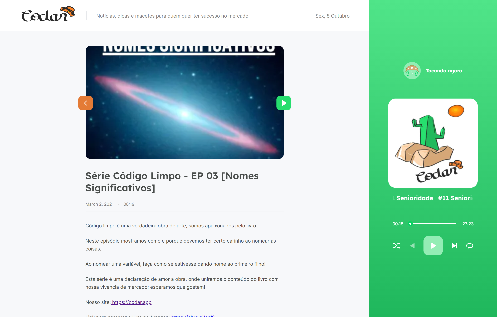
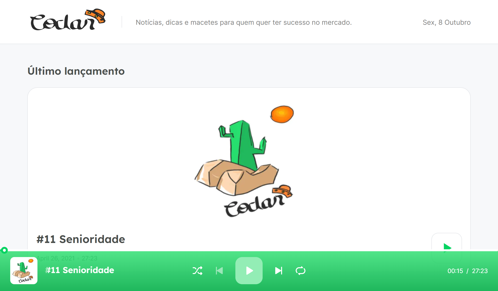
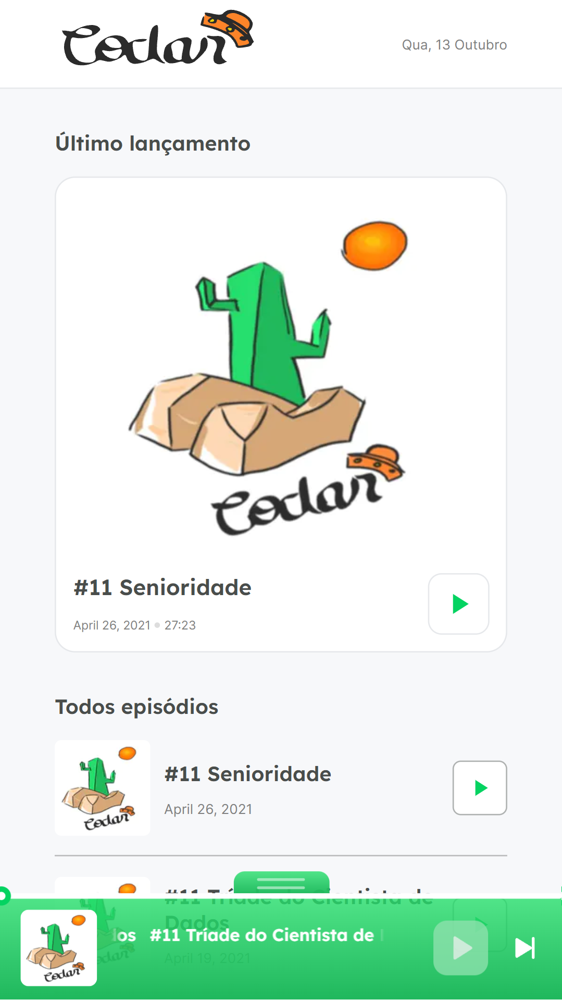
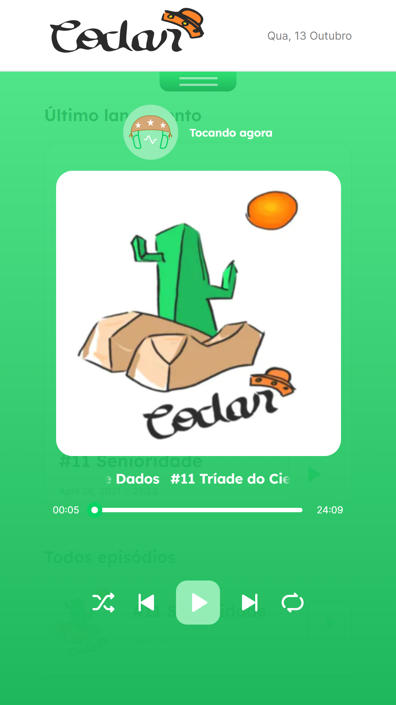
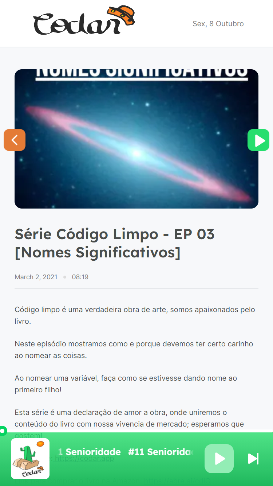

<h1 align="center">
  
</h1>

  <a href="#-teste">Teste</a>&nbsp;&nbsp;&nbsp;|&nbsp;&nbsp;&nbsp;
  <a href="#-sobre">Sobre</a>&nbsp;&nbsp;&nbsp;|&nbsp;&nbsp;&nbsp;
  <a href="#-a-ideia">A ideia</a>&nbsp;&nbsp;&nbsp;|&nbsp;&nbsp;&nbsp;
  <a href="#-tecnologias">Tecnologias</a>&nbsp;&nbsp;&nbsp;|&nbsp;&nbsp;&nbsp;
  <a href="#-layout">Layout</a>&nbsp;&nbsp;&nbsp;|&nbsp;&nbsp;&nbsp;
  <a href="#-direitos">Direitos</a>

---

## 🖱 Teste

O projeto foi hospedado na [Vercel](https://vercel.com/), você pode visualizá-lo aqui:

> https://bora-codar.vercel.app/

---

## ❔ Sobre

O Bora Codar é um podcast criado por [Brenda Costa](https://www.linkedin.com/in/brendacosta23) e [David Math](https://www.linkedin.com/in/me42th), onde falam sobre notícias, dicas e macetes sobre o mundo da tecnologia e o mercado soteropolitado.

---

## 💡 A ideia

Antes de tudo, precisamos saber que esta aplicação é uma breve "homenagem" à comunidade [Onde Codar em Salvador](https://t.me/co0da4r), a qual sou muito grato. Após a 5ª edição do [NLW](https://nextlevelweek.com/) me surgiu a vontade de querer levar a aplicação criada para o próximo nível. Então, porque não juntar o útil ao agradável?!

Para a "captura" dos dados, eu criei um web scraper em [Node.js](https://nodejs.dev/) utilizando a API do [Puppeteer](https://nodejs.dev/), e persistindo os dados no banco de dados do [MongoDB](https://www.mongodb.com/pt-br).

No Front-end adicionei algumas melhorias como a continuidade do áudio ao mudar de rotas utilizando Context API, responsividade e um pequeno efeito estilo "marquee" no título.

---

## ⚙ Tecnologias

Esse projeto foi desenvolvido com as seguintes tecnologias:

- [React](https://reactjs.org)
- [Next.js](https://nextjs.org)
- [TypeScript](https://www.typescriptlang.org/)
- [Sass](https://sass-lang.com/)

---

## 🖼 Layout

O Layout consiste em duas telas (home e internas), totalmente responsivas:

### Desktop

> **Home**

> **Interna**

### Tablet

> **Home**

### Mobile

> **Home**

> **Home (expandido)**

> **Interna**

---

## 📝 Direitos

Todos os direitos dos dados dos podcasts utilizados neste projeto são de interesse do [Bora Codar](https://github.com/devssa/bora-codar/issues)

---

Feito com 💚 por <a href="https://www.linkedin.com/in/arimariojesus/" target="_blank">Arimário Jesus</a>

